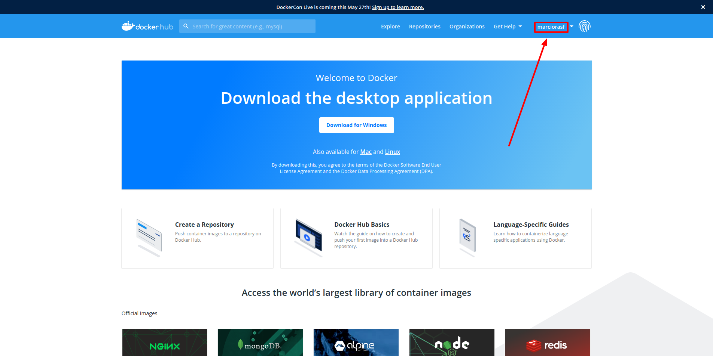

# docker-study

## What is Docker

Docker is a software that providade several tools to work with containers with efficiency, both to the development perspective and the execution performance.

### What is a container

A container is a isolated environment, with the configurations and dependencies needed to execute apps properly inside it. The "isolated" characteristic is essential to the idempotency provided by the use of containers, which means that no matter where the container is executed, the behavior should be the same.

### Container vs Virtual Machine

The main difference between **containers** and **virtual machines**, is that containers virtualize the **operating system**, while virtual machines virtualize the **hardware** to run multiple OS instances.

Consequently, the biggest advantage of using containers is the reduction of the overhead on storage, memory and CPU resources. This can achieved because each container doesn't have to have it own OS.

This advantage can be seen clearly when we compare the size and initialization. Most containers have only megabytes in size and take seconds do start, while VMs have gygabytes and take minutes to initialize.

---

## Why use it

- Idempotency - ensures that the app has the same behavior independently of the environment.

- Faster development - the development environment can be set in some minutes on each machine.

- Quick and simple deploy - most cloud computer services accepts deploying container images.

- Sacalability - because the containers are self-contained, they can be replicated to scale apps.

---

## Basic components

### Docker Client

Docker Client is the way that users usually communicate with the Docker Engine.

### Docker Daemon

The Docker Daemon is responsible to listen for Docker Client requests and based on them, manage Docker objects such as images, containers, networks and volumes.

### Registry

A Docker registry stores Docker images. The default registry used with Docker is the Docker Hub, which is a kind of GitHub for Docker images.

---

## How to use

### Requirements

Docker must be installed. The installation guide can be found [here](https://docs.docker.com/engine/install/ubuntu/).

To this specific tutorial is recommended to fork the repo, so you can use the server on it to create your image.

### Container

A container is a isolated environment used to run apps inside it. The "isolated" characteristic is essential to the idempotency provided by the use of containers, which means that no matter where the container is executed, the behavior should be the same.

#### Run container

```bash
docker container run hello-world
```

Note that when this command is executed, the first line printed is (if you doesn't have this image on yout computer):

```bash
Unable to find image 'hello-world:latest' locally
```

After the message, the image starts to be downloaded. The download is made from Docker Hub. Following the container is created, the program is executed and then the process ends.

If you run the same command again, the image will be available locally, so it doesn't have to be downloaded again.

#### Dettached mode

The hello-world container is created, executed and the finishes. But this is not the expected behavior for several other containers. Let's see an example using an nginx container.

```bash
docker container run nginx
```

After creating the container, you can see that the container stay alive (use **ctrl + c**, to stop the process). To not have to keep a terminal locked with this process, you can use the detach mode with the **-d** option.

```bash
docker container run -d nginx
```

After the container creation, the process exits and container keeps running on background.

#### List containers

To see the your containers, use the following command:

```bash
docker container ls
```

If everything is all right until here, this command should list the dettached nginx container.

Note that the hello-world container are not listed, this occurs, because they're stopped. To list all containers use **-a** option.

```bash
docker container ls -a
```

Now you should see the other containers.

#### Execute command on running container

You can execute commands inside containers:

```bash
docker exec <container_name|container_id> <command>
```

#### Attach to running container

To attach to a container running on background use the **attach** command:

```bash
docker attach <container_name|container_id>
```

#### Port bind

By default, the containers ports aren't accessible from outside docker. To overcome this problem, a port bind can be made using the **-p** option.

```bash
# docker container -p <pc_port>:<container_port> nginx
docker container run -p 8080:80 nginx
```

Now, a nginx welcome should be displayed on <http://localhost:8080>

#### Interactive mode

Some containers can run in interactive mode. For example a ubuntu container that can open a terminal. To achieve this, you have to use the **-it** option.

```bash
docker container run -it ubuntu /bin/bash
```

Enter **exit** command to exit container.

#### Stop container

To stop a container:

```bash
docker container stop <container_name|container_id>
```

#### Start stoppepd containers

Running **ls** command with **-a** option, should show you the nginx container.

If you run again

```bash
docker container run -d -p 8080:80 nginx
```

A new nginx container will be created. Instead, you can just restart the old container with:

```bash
docker container start <name|id>
```

#### Remove container

When using Docker frequently, it's common that your pc ends up as a container cemetary. You can remove these dangling containers.

```bash
docker container rm <container_name|container_id>
```

You can pass more than one container too:

```bash
docker container rm <container_name|container_id> <container_name|container_id>
```

Other option is using **prune** to remove all stopped containers:

```bash
docker container prune
```

#### Create named container

An additional information: you also can create a container with a specific name:

```bash
docker run --name mynginx nginx
```

### Image

A image is file compoused of several layers that works as instructions to create containers. A image is file compoused of several layers that works as instructions to create containers.

#### Create image

I will use a simple NodeJS server to explain the image part of Docker. This server is implemented on **server** folder.

To  do the following steps correctly, your terminal must be on the **server** folder.

If you have NodeJS installed, you can start the server using:

```bash
node index.js
```

This message should be displayed:

```bash
Example app listening at http://localhost:3000
```

If you access the link, you can see a "Hello World!" that means that the server is running correctly.

Now we can create an image to this server.

First, we must create a file named Dockerfile.

The content of the Dockerfile is:

```Dockerfile
# Base image
FROM node:14.16.1-alpine 

# The dir that we will work inside the docker
WORKDIR /app

# Copy package.json and yarn.lock
# It's a good practice copy only this files first to use the Docker cache system
# Docker can identify if the commands have some changes
# If it doesn't have changes, it uses the cached layers
# This process can reduce significantly the build time
# As the dependencies do not change frequently, in most cases it will use the cache
COPY package.json .
COPY yarn.lock .

# Install the dependencies
RUN yarn

# Copy the other files
COPY . .

# Define environment variables
ENV PORT=8080

# Expose the port to communicate with the container outside
EXPOSE 8080

# Command that should be executed after the container creation
CMD ["node", "index.js"]
```

There is a problem with this Dockerfile at:

```Dockerfile
COPY . .
```

At this point all files will be copied to the image, even the node_modules. To solve the problem, we should create a **.dockerignore** file. This file has the same format of a .gitignore.

```.dockerignore
node_modules
```

Now we can build the image:

```bash
# docker image build -t <image_name> <path_to_context>
# To this command works correctly your terminal should be in server folder
docker image build -t image_example .   
```

If the Dockerfile is not at the same folder where your terminal is, you can provide a path to it:

```bash
docker image build -t image_example -f ./Dockerfile .
```

A build’s context is the set of files located in the specified PATH or URL.

If you want to see the cache working, you can run the build command again and see the "---> Using cache" messages.

#### List images

Now let's see the created image:

```bash
docker image ls
```

You should see the created image and the others images used until now.

#### Run container with created image

With the image created, let's run a container using the image:

```bash
docker container run --name example -p 8080:8080 image_example
```

You should see the following message:

```bash
Example app listening at http://localhost:8080
```

And if you access the link you can  see the same "Hello World!" message.

#### Push to Docker Hub

As said in the intro, the Docker Hub is the default Docker registry.

Now we will push our image to the Docker Hub.

First you need to register yourself on [Docker Hub](https://hub.docker.com/).

After the register you can login in Docker on the terminal:

```bash
# Your credentials will be asked, just enter them
docker login
```

While logged in, you can push your imagem to Docker Hub.

To do this you have to build your image using a name with your namespace on Docker Hub, like marciorasf/example. Also, is a good practice to always tag your images.

Let's rebuild the imagem with the correct name and a tag:

```bash
# docker image build -t <namespace>/<image_name>:<tag> <path_to_context>
docker image build -t marciorasf/image_example:v1 .
```

Now we can push our image to Docker Hub:

```bash
# docker push <namespace>/<image_example>:<tag>
docker push marciorasf/image_example:v1
```

If you don't no your namespace you can find it on the Docker Hub page:



Another good practice, is to always push a image with the **latest** tag when you push some now version.

To do this, first we need to tag the image with **latest**:

```bash
# docker tag <namespace>/<image_name>:<existent_tag> <namespace>/<image_name>:<new_tag>
docker tag marciorasf/image_example:v1 marciorasf/image_example:latest
```

Then, push it to Docker Hub:

```bash
docker push marciorasf/image_example:latest
```

### Network

When using Docker containers, frequently we have to enable the communication between containers. For this purpose, there are **networks**. As we can infer by the need to expose the ports of the container to the host using **bind**, the default behavior of Docker is having an internal network.

Actually, Docker has a default network that all containers uses if a specific network is not defined.

In this topic I'll show you how to create a network and use it with the containers.

#### Drivers

Before creating networks, we must know that each network needs a **driver**. A driver is like a pluggable config that enables Docker networks to do intede Docker has several network drivers by default that can be used to accomplish the desired network configuration. I won't dive in the several available drivers because it's a more advanced topic than the intend of this tutorial.

For the moment, I believe that you should only know that the default driver is the **bridge**, that are used when standalone containers needs to communicate with each other.

If you want to know more about networks, check the [oficial docs](https://docs.docker.com/network/).

#### Create a network

```bash
docker network create -d bridge network_example
```

Now let's see the created network:

```bash
docker network ls
```

#### Using the network with containers

We'll use a MongoDB and a MongoExpress (SBGB for mongo) container and communicate them using our created network:

```bash
# run the MongoDB container. We have to name the container so the MongoExpress can find it
docker container run -d --net network_example --name mongo mongo:4.4

# run the MongoExpress container binding the port, so we can access via browser
docker container run --net network_example -p 8081:8081 mongo-express:0.54
```

Now both the MongoDB and MongoExpress containers are running in the **network_example** network. You should be able to open MongoExpress on http://localhost:8081.

### Volume

A volume

#### Host Volume

#### Anonymous Volume

#### Named Volume

## Docker Compose

The docker compose

## Miscellaneous

I've put in this section some additional information and tips that may help you using Docker.

### Good references

- [TechWorld with Nana](https://www.youtube.com/watch?v=3c-iBn73dDE)
- [Amigoscode](https://www.youtube.com/watch?v=p28piYY_wv8)
- [Docker](https://docs.docker.com/)

### Docker command default skeleton

Looking back our tutorial, we can see that the Docker commands assume a kind of a standard skeleton. Understanding the skeleton, you can infer a lot of commands without having to consult the docs. The skeleton is the following:

```bash
docker <object_type> <command>
```

Some examples:

```bash
docker container list
docker image list
docker volume list
docker image rm <id|name>
docker container rm <id|name>
```

### prune

The **prune** command is a convenient way to clean your docker objects

```bash
# docker <object_type> prune
# object_type can be: container, image, network, volume or system
docker system prune
```

### ps

The **ps** command is the same as **docker container ls**. I prefer using **docker container ls** because it's more explicit.

```bash
docker ps
```

### logs

A useful command to see the logs of a container running on dettached mode is:

```bash
docker container logs <id|name>
```
